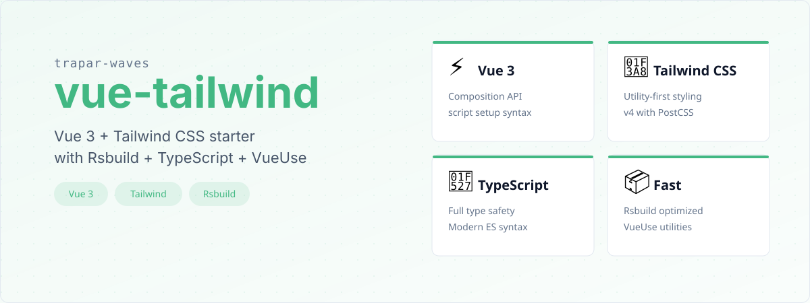
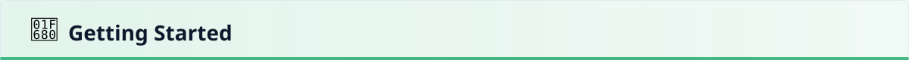
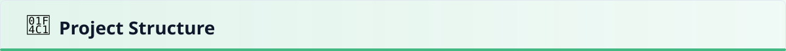
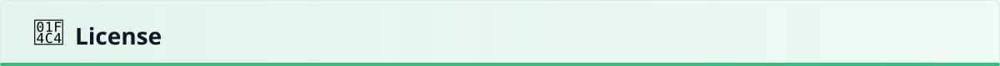

# @trapar-waves/vue-tailwind


---

[English](../README.md) | [日本語](./README-JP.md) | [Русский язык](./README-RU.md)

> 一个现代化的前端开发模板，集成了 Vue 3 和 Tailwind CSS v4，配合 Rsbuild、TypeScript、VueUse 和 Iconify 支持，用于快速 UI 开发。




- **现代框架：** 基于 Vue 3 构建，利用组合式 API 和 `<script setup>` 实现简洁、响应式的组件开发。
- **实用优先的样式：** 采用 Tailwind CSS v4（`tailwindcss`）和 `@tailwindcss/postcss`，实现灵活快速的样式开发，同时保持一致性。
- **快速开发工作流：** 使用 Rsbuild（`@rsbuild/core` 和 `@rsbuild/plugin-vue`）进行优化构建和高效开发服务器性能。
- **响应式工具：** 集成 `@vueuse/core`，提供状态、DOM 和传感器管理的核心 Vue 组合式工具集。
- **图标支持：** 包含 `@iconify/json` 和 `@iconify/tailwind4`，提供可扩展和可定制的图标。
- **类型安全：** 利用 TypeScript (v5.9.x) 提高代码可靠性，并在开发过程中提供强大的类型检查。
- **代码质量：** 包含 ESLint 和 `@antfu/eslint-config` 进行代码检查和最佳实践强制执行。
- **Git Hooks：** 集成 `husky` 和 `lint-staged` 进行提交前检查。


- **框架：** Vue 3（`vue`）
- **样式：** Tailwind CSS v4（`tailwindcss`）
- **响应式工具：** VueUse（`@vueuse/core`）
- **构建工具：** Rsbuild（`@rsbuild/core`）
- **语言：** TypeScript (v5.9.x)
- **CSS 处理：** PostCSS 和 `@tailwindcss/postcss`
- **代码检查：** ESLint 和 `@antfu/eslint-config`
- **图标：** Iconify（`@iconify/json`、`@iconify/tailwind4`）

查看 [package.json](../package.json) 获取完整的依赖列表。



### 前置条件

- Node.js（推荐 >= 18.x）
- 包管理器（npm、yarn 或 pnpm）

### 安装

1. 使用模板创建新项目：

   ```bash
   pnpm create trapar-waves
   ```

2. 导航到项目目录并安装依赖：

   ```bash
   pnpm install
   ```

3. 启动开发服务器：

   ```bash
   pnpm dev
   ```



```
├── public/             # 静态资源
├── src/                # 源代码
│   ├── App.vue         # 根应用组件
│   ├── index.css       # 全局样式和 Tailwind 导入
│   ├── index.ts        # 入口点
│   └── env.d.ts        # TypeScript 环境声明
├── rsbuild.config.ts   # Rsbuild 配置
├── tsconfig.json       # TypeScript 配置
├── eslint.config.js    # ESLint 配置
└── package.json        # 项目依赖和脚本
```


欢迎贡献，非常感谢！请按照以下步骤贡献：

1. Fork 仓库
2. 创建特性分支（`git checkout -b feature/amazing-feature`）
3. 提交更改（`git commit -m 'Add some amazing feature'`）
4. 推送到分支（`git push origin feature/amazing-feature`）
5. 创建 Pull Request



MIT License © 2025 Trapar Waves

## 👤 作者

- **Rikka：** [admin@rikka.cc](mailto:admin@rikka.cc)
- **GitHub 主页：** [Muromi-Rikka](https://github.com/Muromi-Rikka)

## 🔗 链接

- **仓库：** [https://github.com/Trapar-waves/vue-tailwind](https://github.com/Trapar-waves/vue-tailwind)
- **Issues：** [https://github.com/Trapar-waves/vue-tailwind/issues](https://github.com/Trapar-waves/vue-tailwind/issues)
